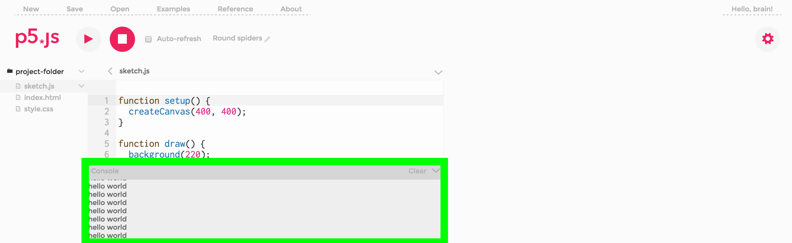

#P5JS Editor Walkthrough

This is a brief walk through of the p5 web editor. 

The p5 web editor allows for p5 sketches to be created, edited and saved in the browser. Sketches are saved to user accounts and can be viewed publically. Media files such as images and sound can be uploaded for use in your sketch. Files must be smaller than 5mb.

The p5 editor is in an alpha phase of development. Please report any bugs or issues you find to us here. 

##Main Menu

- The main navigation menu is where you can start a new sketch, save and open your old sketches. There are also links to examples and the p5 reference page.

- After a sketch is saved, this menu expands with duplucate, download and share.

- SAVE: Saves the sketch to your account and assigns it a unique URL. This unique URL makes it easy to share homework or class examples and is defined by the unique identifier number at the end of the URL. Each sketch is also assigned a two word default name that can be changed.
- Each sketch will be saved to your account with the date.
- DUPLICATE: Duplicates any users sketch to your account where you can edit the code. All p5 sketches are public, however only the owner of the sketch can edit it.
- DOWNLOAD: Downloads a zip of your sketch. The p5 library and any other javascript libraries in use are not included but linked to online CDN versions (in the index.html file). 
- SHARE: Gived options to share your sketch in other places. This includes embed code to generates an iframe that can be included in another website. Fullscreen gives a link to the fullscreen version of your sketch. Edit takes you to the editor page of your sketch.
- OPEN: Open previously saved p5 sketches.
- EXAMPLES: Loads the examples included on the p5js website.
- CONSOLE mirrors the chrome javascript console. 
- REFERENCE: Link to reference page of p5js website.
- ABOUT: links

##Editing Window

- The editing window is where code can be written and edited. 
- The play and stop buttons execute and stop your code running in the output display window that will appear to the right.
- If the auto-refresh checkbox is checked this will make the output on the right update with every change you make. The default when this is unchecked, is that the output will only update if you press the play button.
- The dropdown arrow on the top right of the editing window is where you can autoformat your code. There is also a link here to the keyboard shortcuts for the editor.

- The console is where error and print commands are displayed.

##Project Folder

- The project folder is found by clicking the arrow of the filename. The project folder where is where the file structure pane of your p5 sketch can be viewed. This is where you can toggle between the sketch.js, index.html and style.css files.

- The first dropdown arrow is where you can add in extra files such as additional libraries. You can also arrange your code into folders. 

- The second dropdown arrow is where you can rename or delete files. 

##Adding Libraries

- There are three ways to add extra libraries to your sketch. 
 	- In the index.html file, add links to the CDN versions of the library
	- Use the first dropdown arrow in the project folder and select add file. Drag and drop your libary files in this popup.
	- Using the same popup, a new empty file can be created. You can type/paste your library code there.

##Preferences

- Preferences is located at the cog to the top right of the screen. 

- The preference menu is where the themes, text sizes, sounds and accessibility text based settings can be changed. Accessibility features are being developed for p5 to improve usability for people with low vision.

